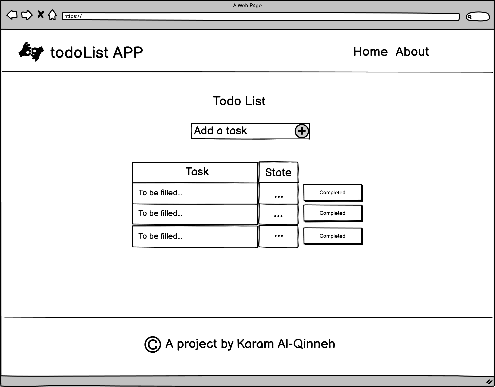
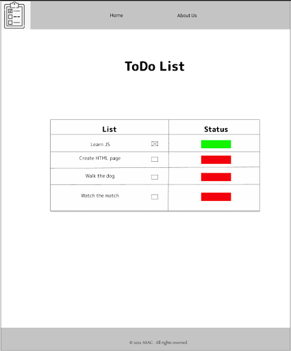
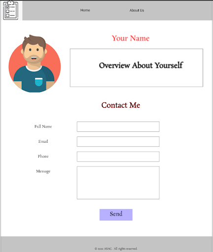

# todo-project

## Project Inroduction

This is my first multi-Task project. I'm building a ToDo List Website, where the Users can display their tasks and check the status for each one.

## Task One Outline

Am going to bulid the HTML structure of a two page app as illustrated in the wireframes below: 

1. Home page wireframe: 
  

2. About page wireframe:
 

## Task Two Outline 

Update the project HTML structure and style it to match the specifications illustrated in the wire frames below: 

1. Home page wireframe: 
  
  

2. About page wireframe:
 
   

## Task Two (Task Questions)

* What observations or questions do you have about what you’ve learned so far?

  There no particular observations. I only have the question are we going to revist CSS again as that isn't stated in prep course outline? As I think CSS is all about practice and one task isn't enough.

* How long did it take you to complete this assignment? And, before you started, how long did you think it would take you to complete this assignment?

  It took me around two hours to complete the task, I thought it would only take an hour because I'm familiar with some CSS concepts. 

## Task Three Outline 
 1. Create javaScript file called app.js and link it with index.html.
2. When the home page is running you will do the following requirements in app.js:
  1.  Ask the user to enter his/her name as input.
  2.  Ask the user to enter his/her gender as input. The answer should be either (male or female).
  3.  Ask the user to enter his/her age as input and alert the user if the age is less than or equal to zero.
  4.  Ask the user to confirm if he wants to skip the welcoming message.
  5.  Alert a welcoming message with the name of the user and the title Mr if the user is male and Ms if the user is female, and if the gender input is not correct alert the welcoming message without the title, according to the confirmation.
  6.  Continue working on the styling of the project.

  ## Task Three 

* What observations or questions do you have about what you’ve learned so far?

  There no particular observations. 

* How long did it take you to complete this assignment? And, before you started, how long did you think it would take you to complete this assignment?

  It took me around 10 minutes to complete the task, This task is suppoesed to be done in less than 5 minutes.

## Task Four Outline

1. As a user, I would like to answer more questions.So you should add new three (Yes/No) questions.
2. If the input was empty consider the answer is "invalid" string.
3. Consider putting all the answers into an array.
4. traverse the array and print the items on the console.
5. Confirm that your code is following the single responsibility rule. Each function should only do one thing.
6. All functions and variables should have a meaningful name (use camelCase).

## Task Four Observations 

* What observations or questions do you have about what you’ve learned so far?

  There no particular observations. 

* How long did it take you to complete this assignment? And, before you started, how long did you think it would take you to complete this assignment?

  It took me around 10 minutes to complete the task, This task is suppoesed to be done in less than 5 minutes.
