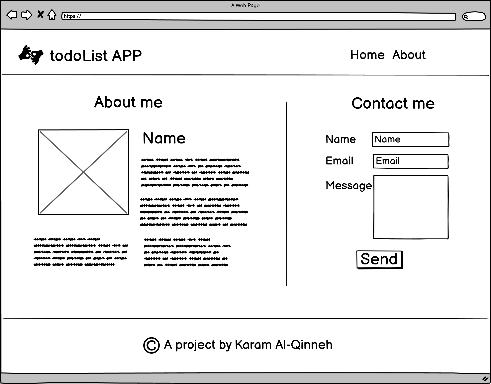

# todo-project

## Project Inroduction

This is my first multi-Task project. I'm building a ToDo List Website, where the Users can display their tasks and check the status for each one.

## Task One Outline

Am going to bulid the HTML structure of a two page app as illustrated in the wireframes below: 

1. Home page wireframe: 
  

2. About page wireframe:
 

## Task Two Outline 

Update the project HTML structure and style it to match the specifications illustrated in the wire frames below: 

1. Home page wireframe: 
  

2. About page wireframe:
  

## Task Two (Task Questions)

* What observations or questions do you have about what you’ve learned so far?

  There no particular observations. I only have the question are we going to revist CSS again as that isn't stated in prep course outline? As I think CSS is all about practice and one task isn't enough.

* How long did it take you to complete this assignment? And, before you started, how long did you think it would take you to complete this assignment?

  It took me around two hours to complete the task, I thought it would only take an hour because I'm familiar with some CSS concepts. 

